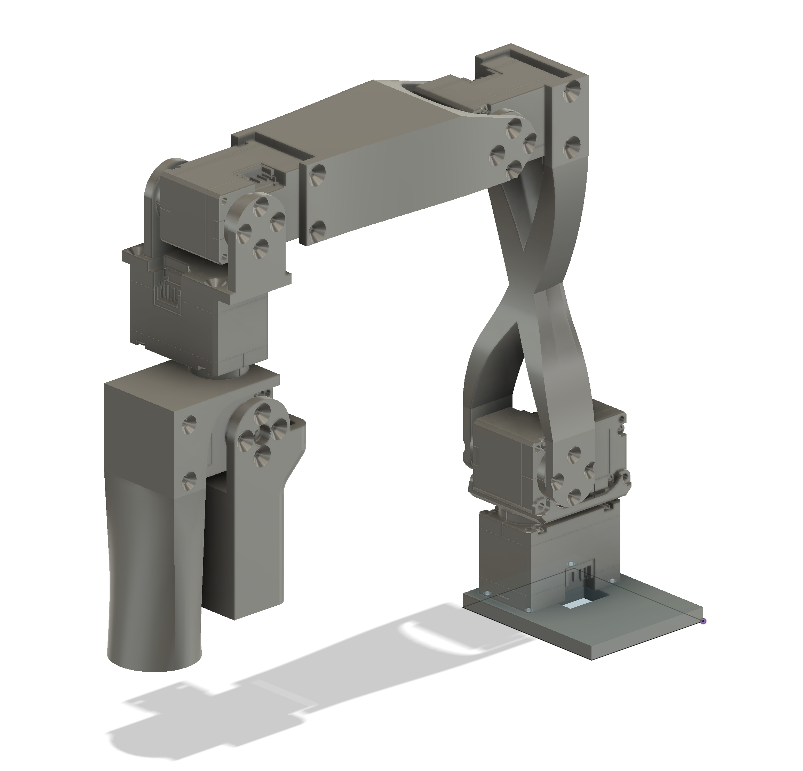

# $250 Robot Arm

Those are buying links for europeans, please read the [README](README.md)

## Follower Arm

### Required Materials
For the amazon links below, change the .fr to **your country's domain**.
| Part                          | Cost | Buying link                                    | Specs |
|-------------------------------|------|------------------------------------------------| --- |
| 2x Dynamixel XL430-W250       | 100€ | https://robosavvy.co.uk/dynamixel-xl430-w250-t.html | https://emanual.robotis.com/docs/en/dxl/x/xl430-w250/ |
| 4x Dynamixel XL330-M288       | 110€  | https://robosavvy.co.uk/robotis-dynamixel-xl330-m288-t.html | https://emanual.robotis.com/docs/en/dxl/x/xl330-m288/|
| XL330 Idler Wheel             | 10€  | https://robosavvy.co.uk/fpx330-h101-4pcs-set.html   | **Note**: pack of four; three needed for  longer version pictured above (with elbow-to-wrist extension), two needed for shorter version shown in the [assembly video](https://youtu.be/RckrXOEoWrk)|
| XL430 Idler Wheel             | 7€   | https://robosavvy.co.uk/hn11-i101-set.html          | |
| Waveshare Serial Bus Servo Driver Board | 10€  | https://amazon.fr/gp/product/B0CJ6TP3TP/ | |
| Voltage Reducer               | 10€   | https://amazon.fr/gp/product/B07XT8C3BK/                       | **Note**: pack of six, only one needed per follower arm |
| 12V Power Supply              | 9€  | https://amazon.fr/gp/product/B09NQFXSVQ                       | |
| Table Clamp                   | 16€   | https://amazon.fr/dp/B09GW56Y44/                         | | **Note**: pack of two, buying this to have the table clamp for both arms, if you only need one, cheaper options are readily available.|
| Wires                         | 7€   | https://amazon.fr/gp/product/B0B1PD6SRH/
| Total                         | 269€ | | **Note**: There will be around 20€ transport fees, this number will differ from one country to another. |
For the amazon links, change the .fr to your country's domain.

## Leader Arm

### Required Materials
For the amazon links below, change the .fr to **your country's domain**.
| Part                          | Cost | Buying link | Specs |
|-------------------------------|------| --- | --- |
| 6x Dynamixel XL330-M077       | 153€ |  https://robosavvy.co.uk/robotis-dynamixel-xl330-m077-t.html | https://emanual.robotis.com/docs/en/dxl/x/xl330-m077/|
| XL330 Frame | 15€   | https://www.mybotshop.de/DYNAMIXEL-FPX330-S101-4PCS-Set_3 | | **Note**: currently not avalible on robosavvy
| XL330 Idler Wheel             | 11€  | https://robosavvy.co.uk/fpx330-h101-4pcs-set.html   | **Note**: pack of four; three needed for longer version (with elbow-to-wrist extension), two needed for shorter version pictured below |
| Waveshare Serial Bus Servo Driver Board | 10€  | https://amazon.fr/gp/product/B0CJ6TP3TP/
| 5V Power Supply               | 10€   | https://amazon.fr/gp/product/B09NGVWBSY/ | |
| Table Clamp                   | 16€   | https://amazon.fr/dp/B09GW56Y44/                         | | **Note**: pack of two, buying this to have the table clamp for both arms, if you only need one, cheaper options are readily available.|
| Total                        | 200€ | | **Note**: There will be around 20€ transport fees, this number will differ from one country to another. |

