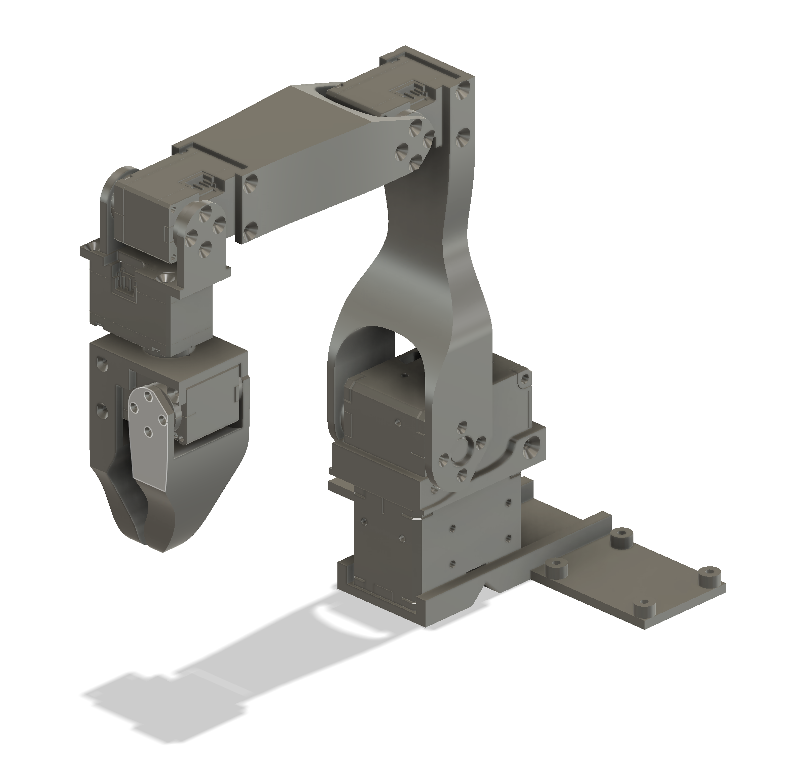

# Dynamixel Robot Arm

This repository contains the files to build and control a low-cost robot arm that costs about $250. You can also build a second robot arm (the leader arm) to control the other arm (the follower arm) that costs about $180, for a total of $430. The design of the leader is inspired by the [GELLO project](https://github.com/wuphilipp/gello_mechanical) but is simpler to build. Such a robot arm is well suited for [robot learning](https://x.com/alexkoch_ai/status/1756500716854841835?s=20). Two of those arms are also capable of [folding clothes](https://x.com/alexkoch_ai/status/1772750496174149708?s=20).

This robot arm uses Dynamixel XL430 and Dynamixel XL330 servo motors. The XL430 motors are almost twice as strong and are used for the first two joints.
The XL330 motors are weaker but weigh only 18g each. This makes the arm very lightweight and fast.
Dynamixel sells the U2D2 adapter to connect the servos to a computer. However, this is very expensive and the latency is very high. This build uses another cheaper adapter board instead.
The robot arm can be controlled with the Dynamixel SDK: ```pip install dynamixel-sdk```


## Follower Arm

### Required Materials

| Part                          | Cost | Buying link                                    | Specs |
|-------------------------------|------|------------------------------------------------| --- |
| 2x Dynamixel xl430-w250       | $100 | https://www.robotis.us/dynamixel-xl430-w250-t/ | https://emanual.robotis.com/docs/en/dxl/x/xl430-w250/ |
| 4x Dynamixel xl330-m288       | $96  | https://www.robotis.us/dynamixel-xl330-m288-t/ | https://emanual.robotis.com/docs/en/dxl/x/xl330-m288/|
| XL330 Idler Wheel             | $10  | https://www.robotis.us/fpx330-h101-4pcs-set/   | |
| XL430 Idler Wheel             | $7   | https://www.robotis.us/hn11-i101-set/          | |
| Serial bus servo driver board | $10  | https://a.co/d/7C3RUYU                         | |
| Voltage Reducer               | $4   | https://a.co/d/iWJlp6A                         | |
| 12V Power Supply              | $12  | https://a.co/d/40o8uMN                         | |
| Table Clamp                   | $6   | https://a.co/d/4KEiYdV                         | |
| Wires                         | $7   | https://a.co/d/hQfk2cb                         | |
| Total                         | $252 |                                                | |

There is usually a 10% discount code for the robotis shop. It might also help to add some grip tape to the gripper (e.g. https://a.co/d/dW7BnEN). A USB-C cable is necessary to connect the servo driver board to a computer.


## Assembly

Video of the assembly: https://youtu.be/RckrXOEoWrk

1. Print all parts with a 3D printer. The STL files are in hardware/follower/stl. The parts are designed to be easy to print. Only the moving part of the gripper needs supports.
2. Assemble the arm without the base. Make sure that the servos are fixed in the same position as in the CAD. The servo horn should be in the default position when screwed in.
3. Solder wires onto voltage reducer. Input should be connected to female connectors and the output to male connectors.
4. Screw the voltage reducer and the servo driver board onto the base
5. Screw the base onto the arm
6. Connect D, V, and G ports on the driver board to the shoulder rotation servo
7. Connect the shoulder rotation servo to the shoulder lift servo
8. Connect the input for the voltage reducer to V and G ports on the driver board
9. Connect the output of the voltage reducer and the remaining D port of the driver board to the elbow servo
10. Connect the driver board to the power supply
11. Connect the driver board to a computer (should work with Linux and macOS)
12. Figure out the device name (e.g. /dev/tty.usbmodem57380045631) ```ls /dev/tty.*```
13. Scan the device with [Dynamixel Wizard](https://emanual.robotis.com/docs/en/software/dynamixel/dynamixel_wizard2/)
14. Connect to an XL330 servo and view the input voltage. Adjust the screw on the voltage reducer until the input voltage is 5V.
15. Set the servo ids to 1 for the shoulder to 5 for the gripper servo
16. Set the baudrate to 1M for all servos.

## Leader Arm

### Required Materials

| Part                          | Cost | Buying link | Specs |
|-------------------------------|------| --- | --- |
| 6x Dynamixel xl330-w077       | $144 |  https://www.robotis.us/dynamixel-xl330-m077-t/ | https://emanual.robotis.com/docs/en/dxl/x/xl330-m077/|
| XL330 Idler Wheel             | $10  | https://www.robotis.us/fpx330-h101-4pcs-set/   | |
| Serial bus servo driver board | $10  | https://a.co/d/7C3RUYU | |
| 5v Power Supply               | $6   | https://a.co/d/5u90NVp | |
| Table Clamp                   | $6   | https://a.co/d/4KEiYdV | |
| XL330 Frame | $7   | https://www.robotis.us/fpx330-s101-4pcs-set/ | |
| Total                        | $183 | | |


The assembly of the leader arm is simpler since all motors use 5v. The gripper is replace by a handle and a trigger. During use, a small torque can be applied to the trigger so that it opens by default. The GELLO design uses a spring for this purpose but it is much more difficult to assemble.
The teleoperation.py script can be used to test the arms. However, the device names might have to be adjusted.
