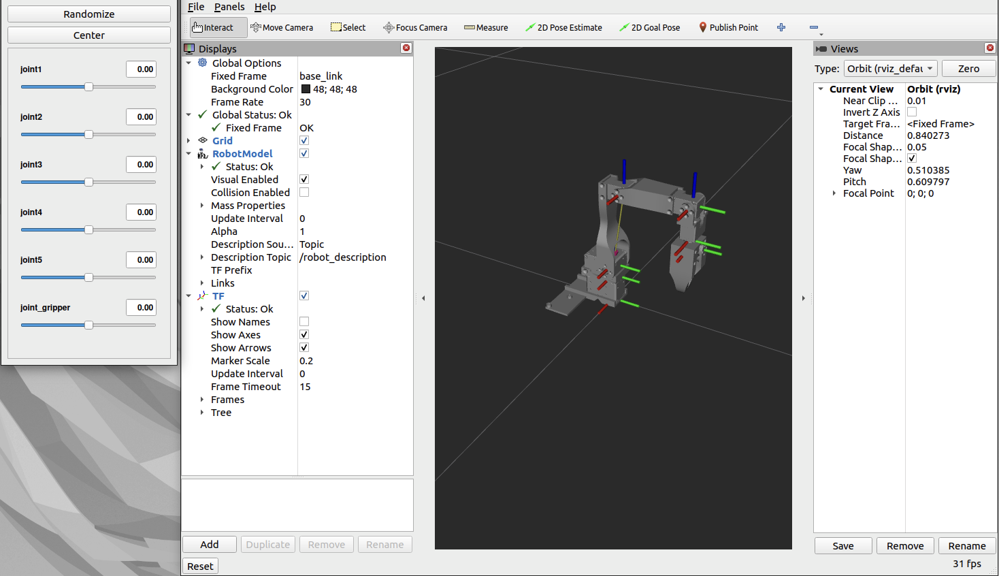
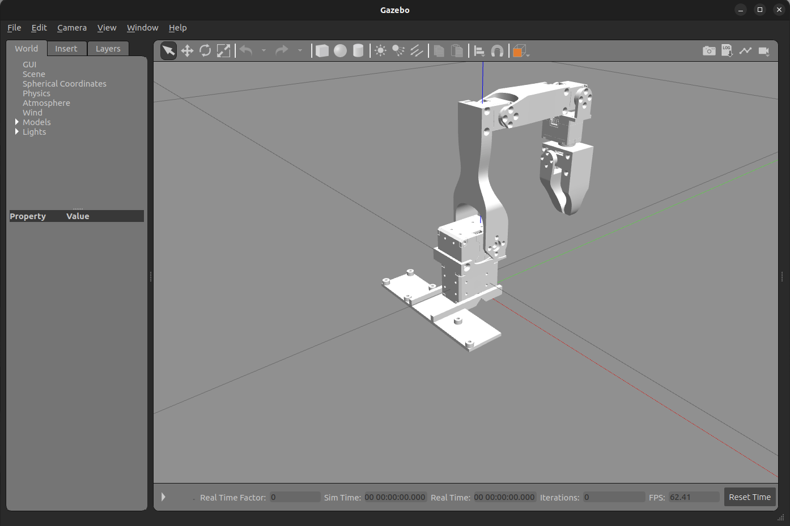

# low_cost_robot_description

## About
- This `ROS 2` package is for the URDF of the robot arm (follower).
- The content of this `ROS 2` package is mainly generated using [`fusion2urdf-ros2`](https://github.com/dheena2k2/fusion2urdf-ros2/tree/8e883d2d66529a77c67edc28d29f2c3ba96169f6) (commit 8e883d2).

## Usage
The usage 1. and 2. are mainly generated using [`fusion2urdf-ros2`](https://github.com/dheena2k2/fusion2urdf-ros2/tree/8e883d2d66529a77c67edc28d29f2c3ba96169f6) (commit 8e883d2).
1. Show the `low_cost_robot` robot arm (follower) in `RViz`:
    ```shell
    ros2 launch low_cost_robot_description display.launch.py
    ```
    

2. Show the `low_cost_robot` robot arm (follower) in `Gazebo`:
    ```shell
    ros2 launch low_cost_robot_description gazebo.launch.py
    ```
    

3. The `URDF` file `low_cost_robot.urdf` is located at `ros2_ws/src/low_cost_robot_description/urdf/low_cost_robot.urdf`.


- >### Known Issue:
    >1. Error output: `[joint_state_publisher_gui-2] /usr/bin/python3: symbol lookup error: /snap/core20/current/lib/x86_64-linux-gnu/libpthread.so.0: undefined symbol: __libc_pthread_init, version GLIBC_PRIVATE`  
    >       - Solution: Refer to the solution for [this issue](https://github.com/ros2/ros2/issues/1406). The solutions are:
    >           1. Use a terminal other than the VS Code terminal.
    >           2. Run `unset GTK_PATH` to unset this environment variable in the VS Code terminal.
    > 2. Error output: `[spawn_entity.py-5] ModuleNotFoundError: No module named 'rclpy._rclpy_pybind11'`
    >    - Solution: This error occurs when you use the conda environment. Just run `conda deactivate` to deactivate the conda environment.

- >### Notice:  
   > Normally, you need to source the ROS 2 setup files and the installation of this workspace after opening the terminal:
   > ```shell
   > # Replace ".bash" with your shell if you're not using bash
   > # Possible values are: setup.bash, setup.sh, setup.zsh
   > # Replace "humble" with your ROS 2 distribution if you're not using "ROS 2 Humble Hawksbill"
   > source /opt/ros/humble/setup.bash
   >
   > # Assume the current directory is `low_cost_robot`
   > cd ros2_ws
   >
   > # Replace ".bash" with your shell if you're not using bash
   > # Possible values are: local_setup.bash, local_setup.sh, local_setup.zsh
   > source install/local_setup.bash
   > ```